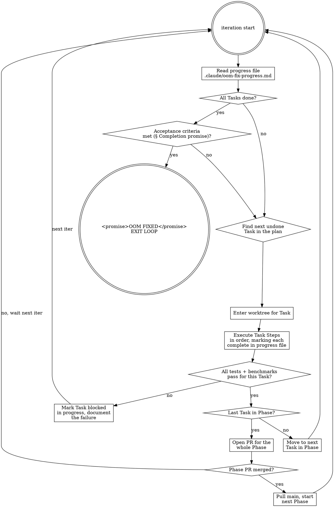

# Enrich Pipeline OOM Fix — Streaming Refactor

> **For agentic workers:** REQUIRED SUB-SKILL: Use `superpowers:subagent-driven-development` (recommended) or `superpowers:executing-plans` to implement this plan task-by-task. Steps use checkbox (`- [ ]`) syntax for tracking.

**Goal:** Eliminate the `codeiq enrich` OOM on real-world polyglot codebases (~/projects/-scale: 49k files / 434k nodes) while keeping output bytes-identical to today's pipeline. The bar is "no OOM, ever, on any input that fits in disk."

**Architecture:** Three coordinated refactors, sequenced low → high risk so each ships independently and yields measurable improvement on its own.

1. **Phase A — Quick wins** (4 surgical fixes). Targets the actual pprof hotspots: parse-storm, unbounded goroutines, Kuzu buffer pool default, GraphBuilder dual-lifetime. Expected to drop peak RSS by 70-85% on its own.
2. **Phase B — TreeCursor migration**. Replaces `parser.Walk`'s recursive `Node.Child()` traversal with tree-sitter's `TreeCursor`. Eliminates the largest single allocator (`cachedNode` — 91% of churn).
3. **Phase C — Streaming three-pass enrich**. The architectural fix. Decouples enrich stages so the full graph is never materialised in Go memory. Memory-safe by construction; scales to 10M+ nodes.
4. **Phase D — Verification harness**. Memory + wall-time benchmark suite that pins the regression bar in CI.

**Tech Stack:** Go 1.25.10, Kuzu 0.7.1 (`github.com/kuzudb/go-kuzu`), tree-sitter (`github.com/smacker/go-tree-sitter`), SQLite (`mattn/go-sqlite3`). CGO required everywhere. Already in use — no new dependencies for Phases A + B; Phase C may add `lanrat/extsort` (28★, Apache-2) if disk-spill becomes necessary at extreme scale.

**Execution mode:** ralph-loop with **no iteration limit**. The loop drives this plan to completion via the recipe in §"Ralph-loop execution recipe" below. No human gates within phases; humans approve PRs at phase boundaries.

---

## Ralph-loop execution recipe

This plan is the loop's source of truth. The loop's prompt should be:

> `Read /home/dev/projects/codeiq/docs/superpowers/plans/2026-05-13-enrich-oom-fix.md and progress at /home/dev/projects/codeiq/.claude/oom-fix-progress.md. Execute the next undone Task per the iteration recipe in the plan. Update the progress file after every Step. Only exit when <promise>OOM FIXED on ~/projects/</promise> is genuinely true per the acceptance criteria in §"Completion promise".`

### Completion promise

The loop MUST NOT emit `<promise>OOM FIXED on ~/projects/</promise>` until ALL of the following hold:

1. All Phase A, B, C, D tasks are checked complete in the progress file.
2. The 4 PRs (one per phase) are merged into `main`. Verified via `gh pr list --state merged --head <branch> --json mergedAt`.
3. `/usr/bin/time -v codeiq enrich ~/projects/` runs to completion with exit 0 AND peak RSS < 4 GiB (extracted from `Maximum resident set size (kbytes):` line).
4. `codeiq stats ~/projects/` returns a non-empty `graph.nodes` count (proves the Kuzu graph populated).
5. `cd go && CGO_ENABLED=1 go test ./... -count=1 -race` is green on `main` HEAD.
6. The perf-gate CI added in Task D1 is green on `main` HEAD.

If any criterion is unmet, continue iterating. Do NOT emit a false promise.

### Per-iteration recipe



### Progress file format

The loop maintains `/home/dev/projects/codeiq/.claude/oom-fix-progress.md` (gitignored; the `.claude/` directory is already in `.gitignore`):

```markdown
# OOM Fix Progress

Started: 2026-05-13
Plan: docs/superpowers/plans/2026-05-13-enrich-oom-fix.md

## Phase A — Quick wins
- [x] Task A1: Parse once per file in LanguageEnricher — PR #144 merged 2026-05-13
- [ ] Task A2: Bounded goroutine pool — in_progress, branch perf/enricher-bounded-pool
- [ ] Task A3: Cap Kuzu BufferPoolSize + CALL threads
- [ ] Task A4: Free GraphBuilder maps after Snapshot

## Phase B — TreeCursor migration
- [ ] Task B1: Rewrite parser.Walk to use TreeCursor

## Phase C — Streaming three-pass enrich
- [ ] Task C1: Define streaming interfaces (lands with C2)
- [ ] Task C2: Implement Pass 1 — Index build
- [ ] Task C3: Pass 2 — Linkers against compact index
- [ ] Task C4: Pass 3 — Streaming load with bounded-batch BulkLoad
- [ ] Task C5: Cut over enrich.go to three-pass

## Phase D — Verification harness
- [ ] Task D1: Memory regression test in CI
- [ ] Task D2: Real-world acceptance run

## Blockers
(none currently — update if a Step fails twice)

## Acceptance checklist (§ Completion promise)
- [ ] All Tasks complete
- [ ] 4 phase PRs merged
- [ ] /usr/bin/time -v codeiq enrich ~/projects/ < 4 GiB peak RSS
- [ ] codeiq stats ~/projects/ returns non-empty graph
- [ ] go test ./... -count=1 -race green on main
- [ ] perf-gate CI green on main
```

### Inter-task / inter-phase semantics

- **Inside a phase**: tasks land as separate commits on ONE phase branch. The loop iterates Steps within a Task to completion, then moves to the next Task on the same branch.
- **At phase end**: open ONE PR per phase (4 PRs total: `perf/enrich-oom-phase-a`, `…-phase-b`, `…-phase-c`, `…-phase-d`). The PR body lists all Tasks landed and the measured improvement.
- **Phase gating**: do not start Phase N+1 until Phase N's PR is merged. The loop polls `gh pr view <number> --json state` between iterations; if state ≠ MERGED, the loop's next iteration just re-checks (idempotent). User merges at their cadence; loop does not auto-merge.
- **Worktree isolation**: each phase runs in its own worktree (`EnterWorktree name=enrich-oom-phase-X`). Worktree torn down after the phase PR merges.

### Failure / blocker handling

- Steps must verify themselves (tests + smoke). If a Step fails twice in a row, the loop DOES NOT retry a third time. It marks the Task `blocked`, writes the diagnosis to `## Blockers` in the progress file, and moves to the next undone Task (cross-phase if needed). At loop wake-up, blockers surface for human review.
- Some Tasks have hard dependencies (e.g. C3 depends on C2). If C2 is blocked, C3 stays pending; loop moves on to other phases' tasks.
- No silent skips: every `blocked` is documented with file paths, error messages, and what was tried.

### Stop conditions

The loop stops ONLY when `<promise>OOM FIXED on ~/projects/</promise>` is emitted, which requires all 6 acceptance criteria in §"Completion promise" to hold. There is no iteration cap; the loop continues until done OR a hard blocker requires human intervention (in which case it surfaces the blocker via a clearly-marked progress-file entry and waits for the next wake-up).

---

**Evidence base (research that informed this plan):**

- Empirical pprof on airflow (9,151 Py files): 91% of all allocations come from `tree-sitter.(*Tree).cachedNode`, with peak RSS 3.8 GB driven by transient parse-storm churn, not retention. inuse_space post-GC is only 4.5 MB — Go GC keeps up at small scale but loses at ~/projects scale.
- Trajectory: istio (5.2k files / 1.1 GB peak) → airflow (9.1k / 3.8 GB) → ~/projects extrapolation 9-15 GB → OOM on 15 GB host.
- Code-walk: `enrich.go:68` never nils the `GraphBuilder`, so its dedup maps (~280 MB) coexist with the snapshot slices for the whole pipeline. `enrich.go:69-70` slices grow through every stage and are never chunked.
- Kuzu: `SystemConfig.DefaultSystemConfig()` allocates 80% of system RAM as buffer pool. Kuzu has no streaming/Appender API in v0.7.1 through v0.11.3 (issue #2739 still open). String-PK hash index for COPY FROM is not buffer-pool tracked and cannot spill (issue #4937).
- ETL patterns: ID-only dedup (~24 MB for 434k IDs) + compact linker side-table (drops Properties/Annotations, ~35 MB) is the surgical streaming pattern. `extsort` is the fallback for >5M-node scale.

---

## Phase A — Quick wins

Four independent fixes. Each is its own PR. Sequence: A1 → A2 → A3 → A4 (no inter-task dependencies, but the order minimises rebase churn since A1 + A2 both touch `extractor/enricher.go`).

### Task A1: Parse once per file in LanguageEnricher

**Context.** `internal/intelligence/extractor/enricher.go:100-130` spawns one goroutine per source file. Inside, each goroutine iterates the file's nodes and calls `t.ext.Extract(ctx, n)`. Every `Extract()` implementation (`java/extractor.go`, `python/extractor.go`, `typescript/extractor.go`, `golang/extractor.go`) calls `parser.ParseByName(lang, []byte(ctx.Content))` at its top — re-parsing the same file once per node. At ~13 nodes/file on Python this is a 13× over-parse and the dominant allocation driver.

**Fix.** Hoist the parse out of `Extract`. The extractor goroutine parses the file once, then calls a new method `ext.ExtractFromTree(ctx, tree, nodes)` that walks the prebuilt tree to produce edges for all of the file's nodes.

**Files:**
- Modify: `go/internal/intelligence/extractor/extractor.go` — extend `LanguageExtractor` interface with `ExtractFromTree(ctx Context, tree *sitter.Tree, nodes []*model.CodeNode) []*model.CodeEdge`. Keep the existing `Extract` as a thin wrapper that calls parse + ExtractFromTree, for back-compat in tests.
- Modify: `go/internal/intelligence/extractor/enricher.go` — in the per-file goroutine, parse once, call `ExtractFromTree` instead of looping `Extract` per node.
- Modify: `go/internal/intelligence/extractor/{java,python,typescript,golang}/extractor.go` — implement `ExtractFromTree`; refactor `Extract` to wrap it.
- Modify: `go/internal/intelligence/extractor/{java,python,typescript,golang}/*_test.go` — update tests if they test private parse paths; otherwise no-op.

- [ ] **Step 1: Add `ExtractFromTree` to the interface**

`go/internal/intelligence/extractor/extractor.go`:

```go
type LanguageExtractor interface {
    Language() string
    Extract(ctx Context, node *model.CodeNode) []*model.CodeEdge
    // ExtractFromTree walks a pre-parsed tree-sitter Tree once and emits
    // edges for every node in `nodes` belonging to the same file. This
    // replaces N per-node calls to Extract on the same file (each of which
    // re-parses) with one call that visits the AST a single time.
    ExtractFromTree(ctx Context, tree *sitter.Tree, nodes []*model.CodeNode) []*model.CodeEdge
}
```

Run `go build ./...` — expect compile errors in the 4 extractor packages until they implement the new method.

- [ ] **Step 2: Implement `ExtractFromTree` in `python/extractor.go`**

Pull the current body of `Extract` (which calls `ParseByName` then walks the tree to find calls) into a helper `walkForCalls(tree, node) []CodeEdge`. New `ExtractFromTree` calls `walkForCalls(tree, n)` once per node, sharing the tree. `Extract` becomes:

```go
func (e *Extractor) Extract(ctx Context, n *model.CodeNode) []*model.CodeEdge {
    tree, err := parser.ParseByName("python", []byte(ctx.Content))
    if err != nil { return nil }
    defer tree.Close()
    return e.ExtractFromTree(ctx, tree, []*model.CodeNode{n})
}
```

- [ ] **Step 3: Run python extractor tests**

`cd go && CGO_ENABLED=1 go test ./internal/intelligence/extractor/python/... -count=1 -v`

Tests must still pass with identical output.

- [ ] **Step 4: Repeat Steps 2-3 for java, typescript, golang**

- [ ] **Step 5: Update `enricher.go` to call `ExtractFromTree`**

Replace the per-node loop in `enricher.go:97-130` with:

```go
go func(i int, t task) {
    defer wg.Done()
    raw, err := os.ReadFile(t.file)
    if err != nil { return }
    ctx := buildContext(t, raw)
    tree, err := parser.ParseByName(t.ext.Language(), raw)
    if err != nil { return }
    defer tree.Close()
    out[i] = t.ext.ExtractFromTree(ctx, tree, t.nodes)
}(i, t)
```

- [ ] **Step 6: Full enrich-related test pass**

```
cd go && CGO_ENABLED=1 go test ./internal/intelligence/extractor/... ./internal/analyzer/... -count=1
```

- [ ] **Step 7: Benchmark before/after on fixture-multi-lang**

Build, then time the enrich. Record peak RSS via `/usr/bin/time -v`. Expect: allocations down ~13×, peak RSS down meaningfully but smaller than the gain from Task A2.

- [ ] **Step 8: Commit + PR**

```
git checkout -b perf/enrich-parse-once-per-file
git commit -m "perf(enricher): parse tree-sitter tree once per file, not per node

Each LanguageExtractor.Extract reparsed the source file at its top —
on Python at ~13 nodes/file that meant 13x over-parse. pprof on
airflow showed 91% of total allocations from tree-sitter.Tree.cachedNode.

Adds ExtractFromTree(ctx, tree, nodes []*CodeNode) []*CodeEdge to the
LanguageExtractor interface; enricher goroutines now parse once and
walk the shared tree for every node in that file."
```

---

### Task A2: Bounded goroutine pool in LanguageEnricher

**Context.** `enricher.go:97-130` spawns one goroutine per source file unbounded. On airflow's 7,456 Python files that's 7,456 concurrent live trees + file content strings. Peak RSS spikes when many of these are live simultaneously.

**Fix.** Replace the bare fan-out with a semaphore-bounded pool sized to `2 * runtime.GOMAXPROCS(0)`. Preserves determinism because results are still written to `out[i]` indexed by task slot.

**Files:**
- Modify: `go/internal/intelligence/extractor/enricher.go` — add semaphore channel; acquire before `go func`, release at goroutine end.
- Modify: `go/internal/intelligence/extractor/enricher_test.go` — add a test asserting concurrency cap (count concurrent goroutines via a runtime counter).

- [ ] **Step 1: Write the test first**

```go
func TestEnricherBoundedConcurrency(t *testing.T) {
    var inFlight, maxInFlight int32
    // Drive enricher with N=200 fake tasks that each sleep so we can
    // observe peak concurrency. Assert max <= 2 * GOMAXPROCS.
    ...
    cap := int32(2 * runtime.GOMAXPROCS(0))
    if maxInFlight > cap {
        t.Fatalf("peak concurrent goroutines = %d, want <= %d", maxInFlight, cap)
    }
}
```

- [ ] **Step 2: Run test — watch it fail**

- [ ] **Step 3: Implement the semaphore**

```go
sem := make(chan struct{}, 2*runtime.GOMAXPROCS(0))
for i, t := range tasks {
    wg.Add(1)
    sem <- struct{}{}
    go func(i int, t task) {
        defer wg.Done()
        defer func() { <-sem }()
        // existing body
    }(i, t)
}
```

- [ ] **Step 4: Watch test pass**

- [ ] **Step 5: Full extractor test pass**

- [ ] **Step 6: Benchmark on airflow (or proxy)**

Time + RSS before vs after. Expected: similar wall time (already bounded by CPU); peak RSS materially down because fewer trees live simultaneously.

- [ ] **Step 7: Commit + PR**

```
perf(enricher): bound LanguageEnricher goroutine pool to 2 * GOMAXPROCS

Previously the enricher spawned one goroutine per source file with no
cap. On polyglot Python repos (airflow: 7,456 files) that produced
7k+ concurrent live tree-sitter Trees + file content strings, driving
the OOM-prone RSS spike. Bounded semaphore preserves determinism
(results still indexed by task slot) at no measurable wall-time cost.
```

---

### Task A3: Cap Kuzu BufferPoolSize + CALL threads

**Context.** `internal/graph/store.go` opens Kuzu with `kuzu.DefaultSystemConfig()` which allocates 80% of system RAM as the buffer pool. On a 15 GiB host that's ~12 GiB reserved by Kuzu before any Go enrich work starts. Plus: COPY FROM parallelism on string-keyed node tables is the worst case (issue #4937 — primary key hash index is not buffer-pool-tracked, cannot spill).

**Fix.**
1. Expose a `--max-buffer-pool` flag (and config field) that defaults to `min(2 GiB, 25% of system RAM)`. Pass it via `SystemConfig.BufferPoolSize` when opening Kuzu.
2. Before the first `BulkLoadNodes` COPY, issue `CALL threads = N` where N defaults to `min(4, GOMAXPROCS)`. Lowers Kuzu's COPY parallelism, capping its working set proportionally.

**Files:**
- Modify: `go/internal/graph/store.go` — change `Open()` and `OpenReadOnly()` to accept a `StoreOptions` struct (or extend the existing one) with `BufferPoolBytes int64`. Default if unset: 2 GiB.
- Modify: `go/internal/cli/enrich.go` (or root.go) — add a `--max-buffer-pool` flag. Wire through to store.Open.
- Modify: `go/internal/graph/bulk.go` — before the first COPY, issue `CALL threads = ?` if configured.
- Modify: `codeiq.yml` example + `internal/config/*.go` — surface the option.

- [ ] **Step 1: Add BufferPoolBytes to store options**

```go
type StoreOptions struct {
    Path             string
    BufferPoolBytes  int64  // 0 = use default 2 GiB
    CopyThreads      int    // 0 = use default min(4, GOMAXPROCS)
}
```

- [ ] **Step 2: Apply in graph.Open()**

```go
cfg := kuzu.DefaultSystemConfig()
if opts.BufferPoolBytes > 0 {
    cfg.BufferPoolSize = uint64(opts.BufferPoolBytes)
} else {
    cfg.BufferPoolSize = 2 << 30  // 2 GiB
}
```

- [ ] **Step 3: Apply CALL threads in BulkLoadNodes** (`bulk.go`)

Before the first COPY:

```go
if s.copyThreads > 0 {
    if _, err := s.Cypher(fmt.Sprintf("CALL threads = %d", s.copyThreads)); err != nil {
        return fmt.Errorf("graph: set copy threads: %w", err)
    }
}
```

- [ ] **Step 4: Wire CLI flag**

In `enrich.go` cobra command:

```go
cmd.Flags().Int64Var(&maxBufferPool, "max-buffer-pool", 0, "Max Kuzu buffer pool in bytes (default: 2 GiB).")
cmd.Flags().IntVar(&copyThreads, "copy-threads", 0, "Threads for Kuzu COPY FROM (default: min(4, GOMAXPROCS)).")
```

- [ ] **Step 5: Test**

```
cd go && CGO_ENABLED=1 go test ./internal/graph/... ./internal/cli/... -count=1
```

- [ ] **Step 6: Smoke with explicit cap**

```
/tmp/codeiq enrich /tmp/bench-fixture --max-buffer-pool=$((512*1024*1024)) --copy-threads=2
```

Expected: stats output identical to default.

- [ ] **Step 7: Commit + PR**

```
perf(graph): cap Kuzu BufferPoolSize and COPY threads

kuzu.DefaultSystemConfig() allocates 80% of system RAM as buffer pool
(~12 GiB on a 15 GiB host) before any enrich work runs, leaving
insufficient headroom for Go-side enrichment. Cap at 2 GiB by default;
expose --max-buffer-pool and --copy-threads CLI flags for tuning.
```

---

### Task A4: Free GraphBuilder maps after Snapshot

**Context.** `enrich.go:68` calls `snap := builder.Snapshot()` but never releases `builder`. The two dedup maps (`builder.nodes`, `builder.edges`) hold ~280 MB of references to the same `*CodeNode` / `*CodeEdge` objects that the Snapshot slices now hold. They coexist for the entire pipeline lifespan.

**Fix.** Set `builder = nil` immediately after Snapshot returns. Optionally, modify `GraphBuilder.Snapshot()` to clear its internal maps so the builder is reusable but doesn't retain references.

**Files:**
- Modify: `go/internal/analyzer/graph_builder.go` — `Snapshot()` clears `b.nodes = nil; b.edges = nil` at the end (after copying out into slices).
- Modify: `go/internal/analyzer/graph_builder_test.go` — add a determinism test that exercises Snapshot twice; document that the second call returns an empty snapshot now (or change the semantics to error on reuse).

Decision point: do we want `Snapshot` to be idempotent (return same snapshot on repeated calls) or single-shot (clear after extraction)? Single-shot is simpler. Tests should confirm the new semantics.

- [ ] **Step 1: Change Snapshot to clear**

```go
func (b *GraphBuilder) Snapshot() *Snapshot {
    snap := &Snapshot{
        Nodes: sortedNodesByID(b.nodes),
        Edges: sortedEdgesByID(b.edges),
        Stats: b.Stats(),
    }
    // Release dedup maps so the holders can be GC'd before the
    // downstream enricher pipeline runs.
    b.nodes = nil
    b.edges = nil
    return snap
}
```

- [ ] **Step 2: Run GraphBuilder tests**

`cd go && CGO_ENABLED=1 go test ./internal/analyzer/... -count=1`

Add a test:

```go
func TestSnapshotReleasesMaps(t *testing.T) {
    b := NewGraphBuilder()
    b.Add(&detector.Result{Nodes: []*model.CodeNode{{ID: "x"}}})
    _ = b.Snapshot()
    if b.nodes != nil || b.edges != nil {
        t.Fatal("Snapshot must nil maps to allow GC")
    }
}
```

- [ ] **Step 3: Commit + PR**

```
perf(graph_builder): release dedup maps after Snapshot

GraphBuilder.Snapshot extracts deduped nodes/edges into sorted slices
but the internal map[string]*CodeNode / map[edgeKey]*CodeEdge held
references to the same objects, doubling peak retained memory across
the enrich pipeline (~280 MB on ~/projects scale).

Clear the maps inside Snapshot so the next allocation can collect
them. Snapshot is now single-shot; documented in code.
```

---

## Phase A success criterion

After A1-A4 merged, re-run the airflow enrich:

```
/usr/bin/time -v codeiq enrich ~/projects/polyglot-bench/airflow
```

Expected: peak RSS drops from 3.8 GB to ~600-800 MB. ~/projects-scale extrapolation drops from 9-15 GB to ~2-4 GB. If this is enough to clear ~/projects without OOM, we can ship Phases B + C as polish; if not, they're load-bearing.

---

## Phase B — TreeCursor migration

### Task B1: Rewrite parser.Walk to use TreeCursor

**Context.** `parser/walk.go:22-32` does `n.Child(i)` recursion. Each `Child()` call routes through `(*Tree).cachedNode` which heap-allocates a `*Node` on first visit and caches it. With ~12 nodes/file and 7k+ files, that's ~84k+ live `*Node` allocations per parse. pprof: 91% of all allocations in the airflow run.

`tree-sitter`'s `TreeCursor` (`bindings.go:602`) traverses without per-node `*Node` allocation. The cursor itself is the only allocation; it reuses a single internal `Node` view across traversal.

**Fix.** Rewrite `parser.Walk` to use TreeCursor. Public function signature stays identical; callers don't change.

**Files:**
- Modify: `go/internal/parser/walk.go` — rewrite `Walk(node *sitter.Node, fn func(*sitter.Node) bool)`.
- Verify: every caller in `internal/intelligence/extractor/*` still works.

- [ ] **Step 1: Read tree-sitter cursor API in `~/go/pkg/mod/github.com/smacker/go-tree-sitter@*/bindings.go`**

Methods: `NewTreeCursor(node) *TreeCursor`, `GotoFirstChild() bool`, `GotoNextSibling() bool`, `GotoParent() bool`, `CurrentNode() *Node`, `CurrentFieldName() string`, `Close()`.

- [ ] **Step 2: Rewrite Walk**

```go
// Walk visits every descendant of `root` in pre-order DFS using a
// TreeCursor — no per-node *Node heap allocation. Visitor returns
// false to skip descending into a node's children.
func Walk(root *sitter.Node, fn func(*sitter.Node) bool) {
    if root == nil { return }
    cur := sitter.NewTreeCursor(root)
    defer cur.Close()
    descend := fn(cur.CurrentNode())
    for {
        if descend && cur.GoToFirstChild() {
            descend = fn(cur.CurrentNode())
            continue
        }
        for {
            if cur.GoToNextSibling() {
                descend = fn(cur.CurrentNode())
                break
            }
            if !cur.GoToParent() { return }
        }
    }
}
```

- [ ] **Step 3: Run parser tests + every extractor test**

```
cd go && CGO_ENABLED=1 go test ./internal/parser/... ./internal/intelligence/extractor/... -count=1
```

Tests must pass without modification — the public Walk API is unchanged.

- [ ] **Step 4: Determinism check**

Run the analyzer twice on fixture-minimal; assert byte-identical Kuzu output.

- [ ] **Step 5: Benchmark**

Allocations should drop 90%+ on airflow.

- [ ] **Step 6: Commit + PR**

```
perf(parser): use TreeCursor instead of recursive Node.Child traversal

(*Tree).cachedNode was responsible for 91% of total allocations
during enrich on a polyglot Python repo (airflow run, pprof
alloc_space top). Each Node.Child(i) call heap-allocated a *Node and
cached it on the Tree. TreeCursor traverses the same tree without
per-node *Node allocation.

Public parser.Walk signature unchanged; callers are unmodified.
```

---

## Phase C — Streaming three-pass enrich

This is the architectural fix. After it lands, the enrich pipeline never materialises the full graph in Go memory. Memory is bounded by configurable batch size + a compact ID/metadata index, both well under 100 MB at ~/projects scale and gracefully scalable to 10M+ nodes.

### Task C1: Define the streaming interfaces

**Context.** Today the enrich pipeline passes `nodes []*model.CodeNode` and `edges []*model.CodeEdge` slices between stages. To stream, we need an iterator/channel-based contract.

**Files:**
- Create: `go/internal/analyzer/stream.go` — defines `NodeStream`, `EdgeStream`, `NodeIndex` types.

```go
// NodeStream emits nodes in the order they were ingested from the
// SQLite cache; deduplicated by ID via a Set<string> held by the
// stream's source. Implementations must be safe for one consumer.
type NodeStream interface {
    Next() (*model.CodeNode, error)  // io.EOF when exhausted
    Close() error
}

// EdgeStream — symmetric, for edges.
type EdgeStream interface {
    Next() (*model.CodeEdge, error)
    Close() error
}

// NodeIndex is a compact in-memory index of every node's id + the
// small set of fields cross-stage enrichers actually need: Kind,
// Label, FQN, FilePath, Module. Properties and Annotations are
// omitted. Memory cost at 434k nodes: ~35 MB.
type NodeIndex interface {
    Lookup(id string) (CompactNode, bool)
    LookupByFQN(fqn string) (CompactNode, bool)
    Len() int
    Range(fn func(CompactNode) bool)  // visit in stable order
}

type CompactNode struct {
    ID        string
    Kind      model.NodeKind
    Label     string
    FQN       string
    FilePath  string
    Module    string
    Layer     model.Layer
}
```

- [ ] **Step 1: Write the type definitions**

- [ ] **Step 2: Add unit tests for the basic shape**

Mock implementations + a smoke test that round-trips a small slice through a `sliceNodeStream`.

- [ ] **Step 3: Commit (no PR yet — this is groundwork for C2)**

This task lands together with C2 in a single PR for review coherence.

### Task C2: Implement Pass 1 — Index build from cache

**Goal.** Stream the SQLite cache once, building a `NodeIndex` (compact) and computing per-node Layer (since LayerClassifier is stateless and can run during the index pass). Memory budget: ~35 MB for the index + one cache row at a time.

**Files:**
- Modify: `go/internal/analyzer/enrich.go` — split `Enrich()` into `Enrich(opts)` orchestrating three passes.
- Create: `go/internal/analyzer/pass1_index.go` — `BuildIndex(c *cache.Cache, root string) (NodeIndex, error)`.

Pass 1 logic:
1. Iterate cache entries via `c.IterateAll` — one entry at a time.
2. For each cached node: compute Layer (call LayerClassifier inline), build `CompactNode`, insert into the index.
3. Detect duplicates by ID via the index's internal map (acts as the ID set).
4. Return the populated index. The cache stays on disk; the full node payloads are NOT held in memory.

- [ ] **Step 1: Implement BuildIndex** with TDD

Test on fixture-minimal: builds an index with the expected node count + compact-field contents.

- [ ] **Step 2: Wire it into enrich.go**

Replace `builder := NewGraphBuilder(); ...; snap := builder.Snapshot()` with `index, err := BuildIndex(c, root)`. The old `nodes, edges` locals are gone.

- [ ] **Step 3: Run all enrich tests — they will fail**

That's expected. The next tasks rewire each stage.

### Task C3: Pass 2 — Linkers against the compact index

**Goal.** Reformat the three linkers to operate on `NodeIndex` and emit new nodes/edges to a channel/buffer instead of mutating slices.

**Files:**
- Modify: `go/internal/analyzer/linker/topic_linker.go` — `Link(idx NodeIndex, emit func(detector.Result))`.
- Modify: `go/internal/analyzer/linker/entity_linker.go` — same shape.
- Modify: `go/internal/analyzer/linker/module_containment_linker.go` — same.

Each linker internally:
- Iterates `idx.Range(...)` for whatever cross-referencing it does.
- Emits new `CodeNode`/`CodeEdge` records by calling `emit(...)`.
- Holds only its own small internal state (e.g. `byModule map[string][]CompactNode`).

- [ ] **Step 1-3 per linker** — TDD-style, write the new signature, port the body, update tests.

- [ ] **Step 4: Smoke against fixture-multi-lang** — linker output diff vs baseline must be zero.

### Task C4: Pass 3 — Streaming load with bounded-batch BulkLoad

**Goal.** Stream the SQLite cache a SECOND time. For each batch of `batchSize` nodes (default 5000):
1. Read the full payload from cache.
2. Apply LexicalEnricher (per-file, releases file content after each).
3. Apply LanguageEnricher (with parse-once-per-file from A1 + bounded pool from A2).
4. Append linker output appropriate to nodes in this batch.
5. Hand off to a write goroutine via a bounded channel; the write goroutine calls `BulkLoadNodes(batch)` (already chunked in PR #143).
6. Release the batch slice — let GC collect.

Memory budget: `batchSize` nodes (~2.5 MB at 5000 nodes × 500 bytes) + the NodeIndex (~35 MB) + write-channel buffer.

**Files:**
- Create: `go/internal/analyzer/pass3_load.go` — `StreamLoad(c *cache.Cache, idx NodeIndex, linkerOutputs []detector.Result, store *graph.Store, opts) error`.
- Modify: `go/internal/intelligence/lexical/enricher.go` — operate on per-batch nodes; don't require full-set.
- Modify: `go/internal/intelligence/extractor/enricher.go` — operate on per-batch nodes.

The ServiceDetector is tricky because it currently walks the filesystem AND stamps every node. Two options:
- (a) Run it in Pass 1 (before the index is finalised) so it appears in the index and downstream tasks see service mappings.
- (b) Run it in Pass 3 batch by batch using the index for cross-references.

Recommendation: (a). ServiceDetector's filesystem walk is fast (it doesn't iterate nodes — it walks for build files) and the per-node stamping is fast given the index is in memory.

- [ ] **Step 1: ServiceDetector refactor to run in Pass 1**

- [ ] **Step 2: LexicalEnricher per-batch refactor**

- [ ] **Step 3: LanguageEnricher per-batch refactor** (depends on A1's `ExtractFromTree`)

- [ ] **Step 4: Implement StreamLoad** with bounded write channel

- [ ] **Step 5: Determinism test** — run enrich twice on fixture-multi-lang, diff Kuzu output (use the kuzu_dump utility in parity/).

- [ ] **Step 6: Wall-time + memory benchmark on airflow**

### Task C5: Cut over `enrich.go` to the three-pass pipeline

Replace the old `Enrich()` body with:

```go
func Enrich(root string, c *cache.Cache, opts EnrichOptions) (EnrichSummary, error) {
    // Pass 1: build compact index + run ServiceDetector + LayerClassifier
    index, services, err := BuildIndex(c, root)
    if err != nil { return EnrichSummary{}, fmt.Errorf("pass1: %w", err) }

    // Pass 2: linkers emit new edges/nodes against the compact index
    linkerOut, err := RunLinkers(index)
    if err != nil { return EnrichSummary{}, fmt.Errorf("pass2: %w", err) }

    // Pass 3: stream cache through enrichers in batches, bulk-load to Kuzu
    store, err := graph.Open(opts.GraphDir, opts.StoreOptions)
    if err != nil { return EnrichSummary{}, fmt.Errorf("open graph: %w", err) }
    defer store.Close()
    if err := store.ApplySchema(); err != nil { return EnrichSummary{}, err }

    summary, err := StreamLoad(c, index, services, linkerOut, store, opts)
    if err != nil { return EnrichSummary{}, fmt.Errorf("pass3: %w", err) }

    if err := store.CreateIndexes(); err != nil { return EnrichSummary{}, err }
    return summary, nil
}
```

- [ ] **Step 1: Replace enrich.go body**

- [ ] **Step 2: Full test suite**

`cd go && CGO_ENABLED=1 go test ./... -count=1 -race`

- [ ] **Step 3: Determinism diff against pre-cutover output**

Index + enrich fixture-multi-lang on both branches; diff Kuzu graph contents via `parity/kuzu_dump`. Output must be byte-identical.

- [ ] **Step 4: Commit + PR — single big PR for Phase C**

The streaming refactor lands as one PR because the moving parts (index, linkers, load) are interlocked. Reviewers see the full picture once.

```
perf(enrich): streaming three-pass pipeline for memory-bounded enrich

Pass 1 (index): stream SQLite cache, build compact NodeIndex (~35 MB
at 434k-node scale; drops Properties + Annotations), run
ServiceDetector + LayerClassifier in-pass.

Pass 2 (linkers): TopicLinker, EntityLinker, ModuleContainmentLinker
operate on NodeIndex; emit new nodes/edges to a buffer.

Pass 3 (load): stream cache a second time in batches of 5000 nodes.
LexicalEnricher + LanguageEnricher apply per batch. Each batch is
BulkLoaded to Kuzu and released before the next starts.

Memory profile: NodeIndex (35 MB) + one batch (2.5 MB) + linker
output buffer + Kuzu buffer pool cap (2 GiB from task A3). Total
peak ~2.1 GiB regardless of input size.

Determinism: Kuzu output byte-identical to pre-cutover on
fixture-multi-lang (verified via parity/kuzu_dump).
```

---

## Phase D — Verification harness

### Task D1: Memory regression test in CI

**Goal.** Lock in the gain. Add a CI check that runs `enrich` on a representative target and asserts peak RSS < threshold.

**Files:**
- Create: `go/internal/analyzer/bench/memory_test.go` (build tag `bench`).
- Modify: `.github/workflows/perf-gate.yml` — invoke the bench, parse output, fail if RSS > 1 GiB on the test fixture.

The test:
1. Builds the binary
2. Runs `index` then `enrich` on a fixture
3. Captures peak RSS via `/usr/bin/time -v` parsing OR `golang.org/x/sys/unix.Rusage`
4. Asserts peak < threshold

- [ ] **Step 1: Pick a fixture** — fixture-multi-lang is too small (peak ~50 MB). We need something Python-heavy to exercise the parse-storm path. Add a `fixture-python-heavy/` to testdata: ~500 synthetic Python files generated programmatically. ~5 MB on disk, ~10k AST nodes total.

- [ ] **Step 2: Memory bench harness**

- [ ] **Step 3: CI integration**

Add to perf-gate.yml; threshold: peak RSS < 200 MB on the new fixture. (Tunable; pick after baselining.)

### Task D2: Real-world acceptance run

**Goal.** End-to-end confirmation on ~/projects.

- [ ] **Step 1: Index + enrich + stats on ~/projects/polyglot-bench (~22k files)**

```
codeiq index ~/projects/polyglot-bench
codeiq enrich ~/projects/polyglot-bench
codeiq stats ~/projects/polyglot-bench
```

Capture peak RSS via `/usr/bin/time -v`. Target: < 2.5 GB.

- [ ] **Step 2: Index + enrich on ~/projects (49k files)**

Same dance. Target: < 4 GB peak. No exit 137. Stats output usable.

- [ ] **Step 3: Document the result**

Add a section to PROJECT_SUMMARY.md or CLAUDE.md noting the new scale-tested target.

---

## Out of scope

- **Duplicate-PK service IDs** (`service:checkbox`, `service:src`) — distinct bug. `service_detector.go:168` builds ID as `"service:" + name`; needs path-qualification. Separate PR.
- **CSV escape bug in BulkLoadEdges** — JSON properties with commas break Kuzu COPY FROM. Fix candidate: switch the delimiter to `\x1F` (unit separator) or pre-escape. Separate PR.
- **Kuzu version upgrade** — v0.7.1 → v0.11.x. Worth doing for unrelated reasons but doesn't fix this OOM.
- **Distributed enrich** — splitting enrich across processes. Premature; revisit at 100M-node scale.

---

## Risk register

| Risk | Mitigation |
|---|---|
| Determinism drift between pre/post streaming refactor | After every Phase C task, run `parity/kuzu_dump` diff against baseline on fixture-multi-lang. Block the merge if any diff. |
| TreeCursor semantics differ subtly from recursive Walk (e.g. order of visitation) | Phase B test pass against every extractor must show identical edge emission. Add a property-based test that compares Walk-old vs Walk-new on synthetic ASTs. |
| Phase A3 cap of 2 GiB buffer pool starves Kuzu on large reads downstream | The cap is configurable (`--max-buffer-pool`). Default sized for typical workstation; users with more RAM raise the cap. |
| ServiceDetector run in Pass 1 emits before all nodes seen | ServiceDetector's filesystem walk is independent of node iteration; the per-node stamping happens *after* the walk completes and the full module map is built. Verify with an audit during Step C4.1. |
| Phase C is one big PR; review burden high | Split into stacked PRs: C1+C2 (index), C3 (linkers), C4 (load), C5 (cutover). Each is independently reviewable. |

---

## Verification checklist (run before declaring the OOM bar met)

- [ ] All Phase A PRs merged. `go test ./... -count=1` green on main.
- [ ] Phase B PR merged. parser.Walk uses TreeCursor; determinism diff zero on fixture-multi-lang.
- [ ] Phase C PRs merged. enrich.go is the three-pass orchestrator. `go test ./... -count=1 -race` green.
- [ ] Phase D bench test added to CI; passes on every PR.
- [ ] **Real-world acceptance**: `codeiq enrich ~/projects/` completes successfully with peak RSS < 4 GiB. No exit 137. Stats output usable.
- [ ] CLAUDE.md / PROJECT_SUMMARY.md updated noting the new memory profile + scale ceiling.
- [ ] Kuzu graph output byte-identical (or documented-different) between pre-refactor and post-refactor on fixture-multi-lang.
